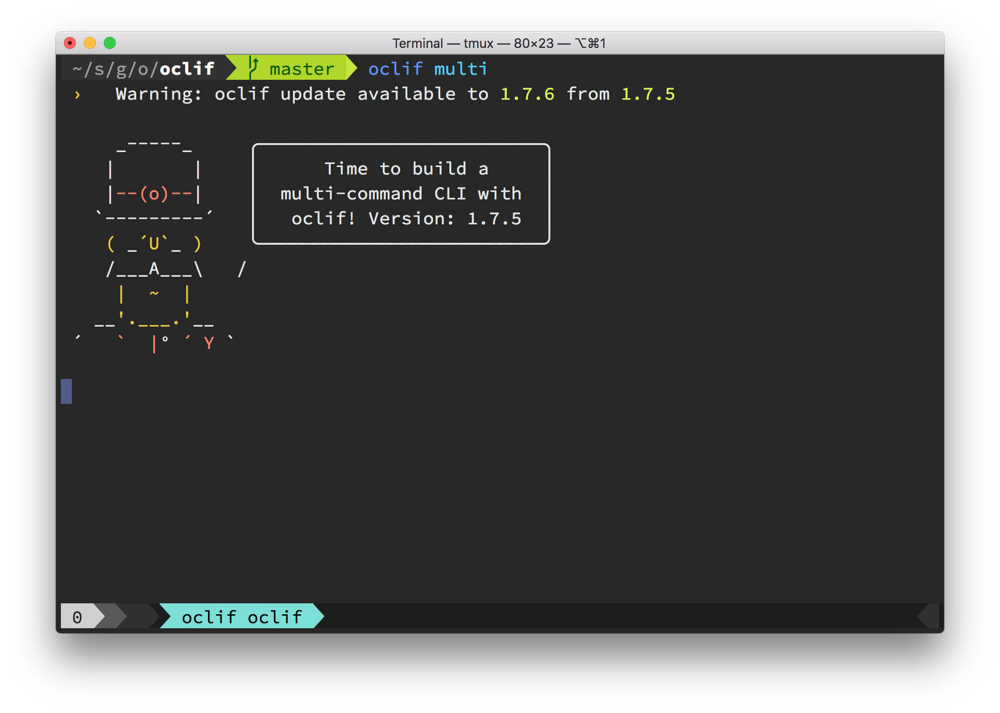

@oclif/plugin-warn-if-update-available
======================================

warns if there is a newer version of CLI released

[](https://npmjs.org/package/@oclif/plugin-warn-if-update-available)
[](https://circleci.com/gh/jdxcode/plugin-warn-if-update-available/tree/master)
[](https://ci.appveyor.com/project/jdxcode/plugin-warn-if-update-available/branch/master)
[](https://codecov.io/gh/jdxcode/plugin-warn-if-update-available)
[](https://greenkeeper.io/)
[](https://npmjs.org/package/@oclif/plugin-warn-if-update-available)
[](https://github.com/jdxcode/plugin-warn-if-update-available/blob/master/package.json)

<!-- toc -->
* [What is this?](#what-is-this)
* [Installation](#installation)
<!-- tocstop -->

# What is this?

This plugin shows a warning message if a user is running an out of date CLI.



# How it works

This checks the version against the npm registry asynchronously in a forked process, at most once per 24 hours. It then saves a version file to the cache directory that will enable the warning. The upside of this method is that it won't block a user while they're using your CLI—the downside is that it will only display _after_ running a command that fetches the new version.

# Installation

Add the plugin to your project with `yarn add @oclif/plugin-warn-if-update-available`, then add it to the `package.json` of the oclif CLI:

```js
{
  "name": "mycli",
  "version": "0.0.0",
  // ...
  "oclif": {
    "plugins": ["@oclif/plugin-help", "@oclif/plugin-warn-if-update-available"]
  }
}
```
